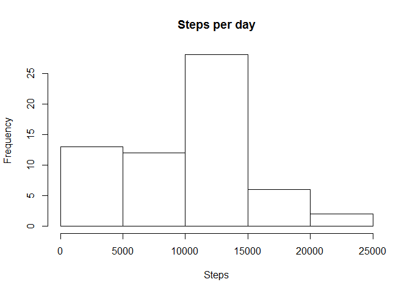
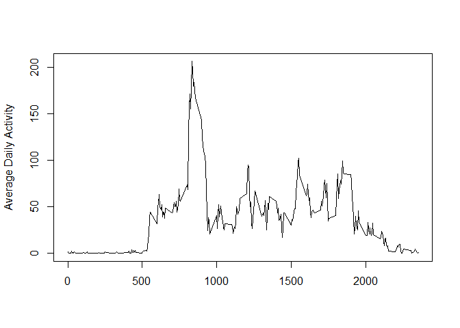

# Reproducible Research: Peer Assessment 1


## Loading and preprocessing the data


1.Load the data (i.e. read.csv())

```r
ds <- read.csv("./activity.csv")
```

2.Process/transform the data (if necessary) into a format suitable for your analysis

q1stp will be using for Q1 which calculates total number of steps a day

```r
q1stp <- aggregate(ds$steps, by=list(date=ds$date), FUN=sum, na.rm = TRUE)
```

q2stp will be using for Q2 which average steps per interval per date.

```r
q2stp <- aggregate(ds$steps, by=list(interval=ds$interval), FUN=mean, na.rm = TRUE)
```


## Q1. What is mean total number of steps taken per day?

1.Make a histogram of the total number of steps taken each day

```r
hist(q1stp$x, main="Steps per day", xlab="Steps")
```

 

2.Calculate and report the mean and median total number of steps taken per day

```r
mean(q1stp$x)
```

```
## [1] 9354.23
```

```r
median(q1stp$x)
```

```
## [1] 10395
```

## Q2. What is the average daily activity pattern?

1.Make a time series plot (i.e. type = "l") of the 5-minute interval (x-axis)
and the average number of steps taken, averaged across all days (y-axis)

```r
plot(q2stp$interval, q2stp$x, type="n", main="", xlab="", ylab="Average Daily Activity")
lines(q2stp$interval, q2stp$x, type='l')
```

 


2.Which 5-minute interval, on average across all the days in the dataset,
contains the maximum number of steps?

```r
q2stp[which(q2stp$x == max(q2stp$x)),]
```

```
##     interval        x
## 104      835 206.1698
```

## Q3. Imputing missing values

1.Calculate and report the total number of missing values in the dataset
(i.e. the total number of rows with NAs)

```r
length(which(is.na(ds$steps)))
```

```
## [1] 2304
```

2.Devise a strategy for filling in all of the missing values in the dataset. The
strategy does not need to be sophisticated. For example, you could use
the mean/median for that day, or the mean for that 5-minute interval, etc.


3.Create a new dataset that is equal to the original dataset but with the
missing data filled in.


4.Make a histogram of the total number of steps taken each day and Calculate
and report the mean and median total number of steps taken per day. Do
these values differ from the estimates from the first part of the assignment?
What is the impact of imputing missing data on the estimates of the total
daily number of steps?


## Q4. Are there differences in activity patterns between weekdays and weekends?


1.Create a new factor variable in the dataset with two levels - "weekday"
and "weekend" indicating whether a given date is a weekday or weekend
day.


2.Make a panel plot containing a time series plot (i.e. type = "l") of the
5-minute interval (x-axis) and the average number of steps taken, averaged
across all weekday days or weekend days (y-axis). The plot should look
something like the following, which was creating using simulated data:

